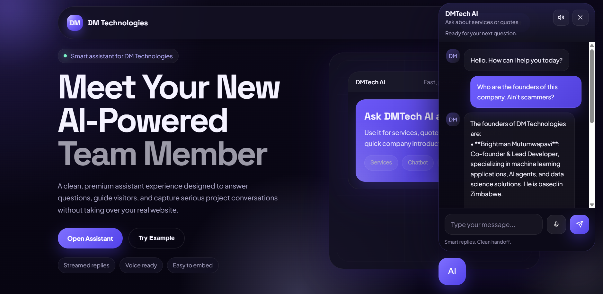

# DMTech AI Assistant



[Live Demo](https://dmtech-ai-customer-assistant.onrender.com/)

## Overview

DMTech AI Assistant is a smart customer-facing chatbot built for DM Technologies to help businesses engage website visitors professionally, answer service-related questions instantly, and capture serious leads in real time.

The project combines a clean premium frontend experience with an AI-powered backend that can:

- introduce the company clearly
- explain services in a professional way
- respond to client questions instantly
- guide potential customers toward quotes and consultations
- maintain a more polished first impression than a basic toy chatbot

This assistant is designed to be embedded into a larger company website, making it a strong digital touchpoint for modern businesses that want to improve communication, response speed, and conversion.

## Why This Project Matters

Many businesses lose opportunities because website visitors do not get answers quickly enough. A well-designed AI assistant helps solve that by staying available at all times, reducing friction, and creating a smoother path from visitor interest to business enquiry.

For companies in Zimbabwe and across Africa, this can be especially impactful because:

- customers often want quick answers before making direct contact
- small and growing businesses may not always have full-time support teams online
- digital trust is improved when a website feels modern, responsive, and professional
- AI support can help local businesses compete with larger brands through better customer experience

## Business Impact

DMTech AI Assistant can support business growth in several practical ways:

- 24/7 response capability for website visitors
- faster handling of frequently asked questions
- stronger lead qualification before human follow-up
- improved professionalism and trust on first visit
- reduced workload for founders and small teams
- better conversion of traffic into enquiries

Instead of letting visitors leave without action, the assistant helps keep them engaged and guides them toward the next step.

## Healthcare Relevance in Zimbabwe

This type of assistant can be highly valuable for healthcare-focused businesses, clinics, medical startups, and digital health platforms in Zimbabwe.

Potential healthcare use cases include:

- answering common patient questions
- sharing available services and care information
- guiding patients on how to make an enquiry
- helping clinics present a more trusted and organized digital presence
- improving access to health-related information for users who need immediate guidance

In the Zimbabwean context, digital healthcare tools can help bridge communication gaps between service providers and the public. While this chatbot is not a medical diagnosis system, it shows how AI can support healthcare organizations by improving accessibility, responsiveness, and service communication.

## Features

- AI-powered assistant using OpenAI
- streaming responses for a real-time chat experience
- dark premium interface inspired by modern AI product design
- voice input support in compatible browsers
- voice output support in compatible browsers
- session-based conversation flow
- company knowledge loaded from a local information file
- clean Flask backend for lightweight deployment
- Render-ready deployment setup

## Tech Stack

- Python
- Flask
- OpenAI API
- Flask-CORS
- Python-Dotenv
- Gunicorn
- HTML
- CSS
- JavaScript

## Project Structure

```text
DMTechAi/
├── app.py
├── index.html
├── info.txt
├── requirements.txt
├── render.yaml
├── README.md
```

## How It Works

The application serves a premium frontend interface from Flask and connects user messages to the OpenAI API. The assistant uses company-specific knowledge from `info.txt` so that answers stay aligned with DM Technologies.

Conversation history is stored per session, which helps the chatbot stay consistent within a user conversation while still keeping the system lightweight.

## Local Setup

1. Clone or download the project.
2. Create a virtual environment.
3. Install dependencies:

```bash
pip install -r requirements.txt
```

4. Add your OpenAI API key in `.env`:

```env
OPENAI_API_KEY=your_key_here
```

5. Run the app:

```bash
python app.py
```

6. Open your browser and visit:

```text
http://127.0.0.1:5000
```

## Deployment

This project is prepared for deployment on Render.

Main deployment files:

- `app.py`
- `requirements.txt`
- `render.yaml`
- `index.html`
- `info.txt`

On Render, set the environment variable:

```env
OPENAI_API_KEY=your_key_here
```

## Future Potential

This project can grow into a much larger business tool with features such as:

- CRM integration
- WhatsApp integration
- analytics dashboards
- multilingual support
- industry-specific assistants
- appointment or enquiry workflows
- healthcare-specific support experiences

## Author

Built for DM Technologies by Brightman as a smart AI assistant experience for modern business engagement, lead capture, and digital transformation.
